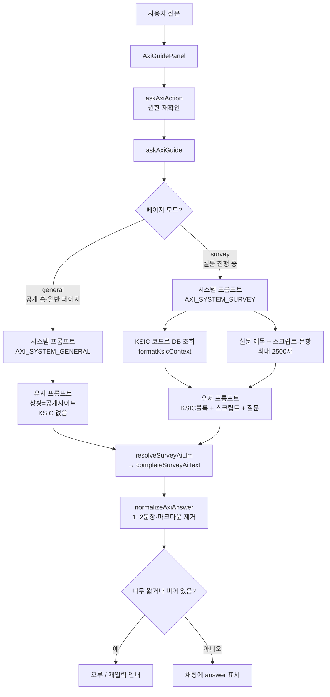
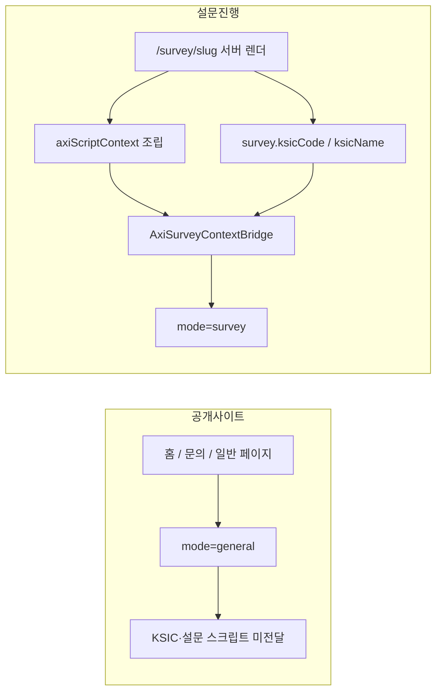
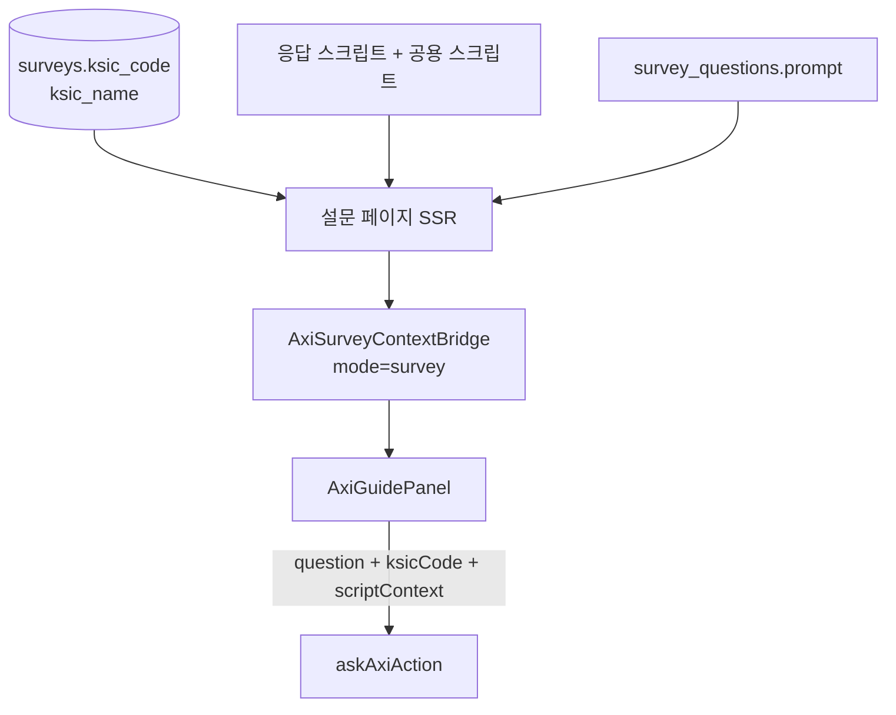
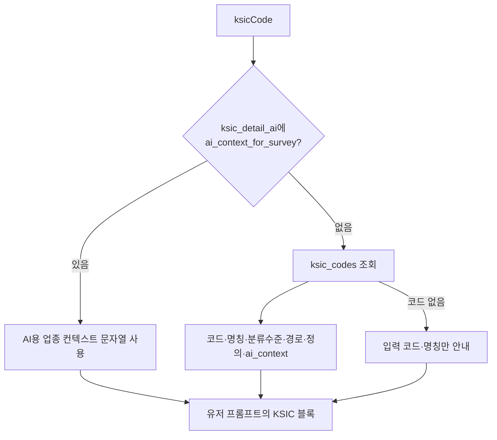
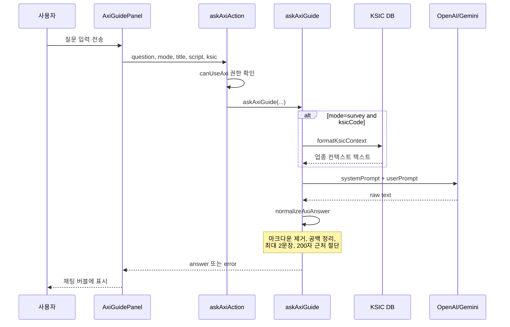
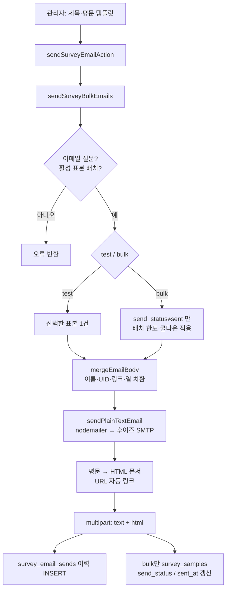
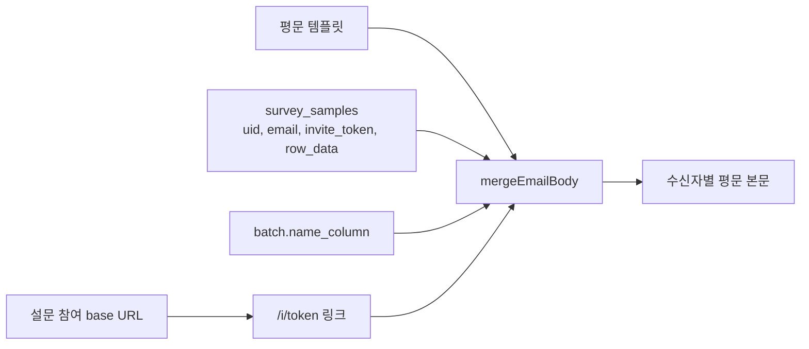
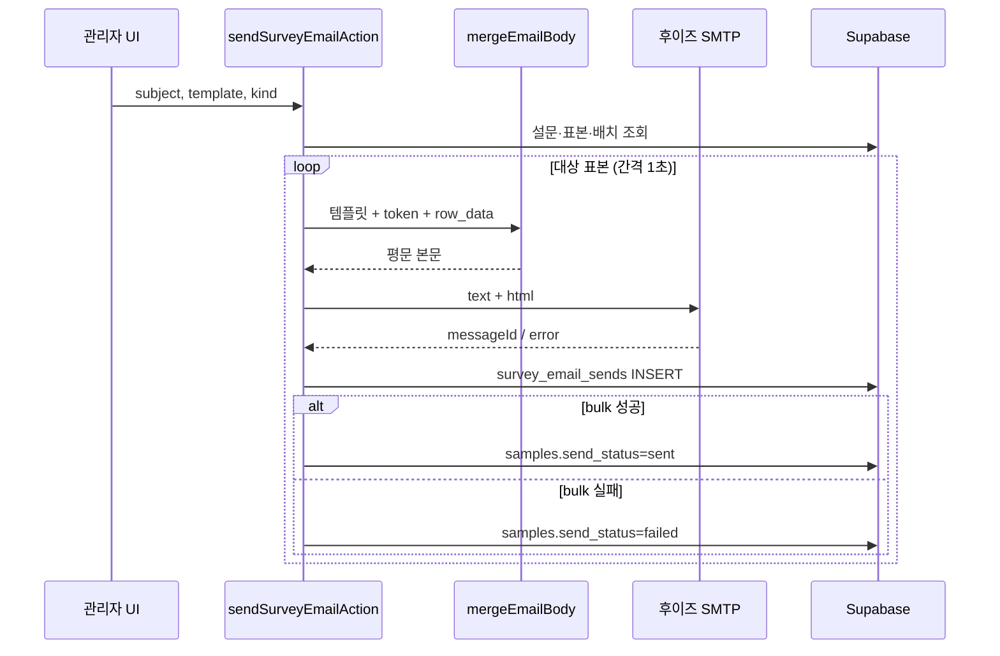

# AXI · 이메일 발송 내부 처리 (기술·발주자 설명용)

화면 버튼 흐름이 아니라, **무엇을 어떻게 조립·변환·전송하는지**를 코드 기준으로 정리합니다.

## 비전공자용 그림 (PPT 삽입용 PNG)

| 파일 | 내용 |
|------|------|
| [05-axi-how-it-works.png](./05-axi-how-it-works.png) | AXI가 답을 만드는 방법 |
| [06-axi-home-vs-survey.png](./06-axi-home-vs-survey.png) | 홈 vs 설문 · 업종(KSIC) 인식 |
| [07-email-how-it-works.png](./07-email-how-it-works.png) | 이메일 발송 방법 |
| [08-email-safety-limits.png](./08-email-safety-limits.png) | 안전하게 보내는 규칙 |

재생성: `node scripts/generate-axi-email-diagrams.mjs`

---

- [AXI 응답 처리](#axi-응답-처리)
- [이메일 발송 처리](#이메일-발송-처리)

---

# AXI 응답 처리

관련 코드: `lib/axi/ask.ts`, `lib/survey-ai/llm.ts`, `lib/ksic-db.ts`, `components/site/AxiSiteContext.tsx`, `app/(site)/survey/[slug]/page.tsx`

---

## 1. 한눈에 보기



---

## 2. 사용하는 AI

AXI는 **설문 AI 생성과 동일한 LLM 설정**을 씁니다 (`resolveSurveyAiLlm`).

| 환경변수 | 역할 |
|----------|------|
| `SURVEY_AI_PROVIDER` | `openai` / `gemini` / 미설정(auto) |
| `OPENAI_API_KEY` + `OPENAI_MODEL` | OpenAI (기본 모델 `gpt-4o-mini`) |
| `GEMINI_API_KEY` + `GEMINI_MODEL` | Gemini (기본 모델 `gemini-2.5-flash`) |

**선택 규칙**
1. provider가 `openai`/`gemini`로 고정되면 해당 키·모델 사용  
2. auto이면 OpenAI 키가 있으면 OpenAI, 없으면 Gemini  
3. 키 없으면 호출 실패

**호출 파라미터** (`completeSurveyAiText`)
- temperature: `0.3`
- maxTokens: `1024`
- Gemini thinkingBudget: `0` (사고 토큰이 답을 자르지 않도록)
- thinking 미지원 오류 시 thinking 없이 1회 재시도

---

## 3. 모드 분기: 공개 홈 vs 설문 진행 중

| | 공개 홈·일반 페이지 | 설문 `/survey/[slug]` 진행 중 |
|--|---------------------|-------------------------------|
| mode | `general` | `survey` |
| 맥락 주입 | 없음 (빈 컨텍스트) | `AxiSurveyContextBridge`가 제목·스크립트·KSIC 주입 |
| KSIC | **사용하지 않음** | 설문의 `ksic_code` / `ksic_name` 사용 |
| 시스템 프롬프트 | `AXI_SYSTEM_GENERAL` | `AXI_SYSTEM_SURVEY` |

설문 페이지를 떠나면 Bridge가 컨텍스트를 비워 다시 `general`로 돌아갑니다.



---

## 4. 시스템 프롬프트 (역할·규칙)

### 4-1. 일반 모드 (`AXI_SYSTEM_GENERAL`)

요지:
- Research Hub **공개 사이트**에서 직원·조사원 안내
- 플랫폼 이용, 조사·설문 **일반 용어** 설명
- 한국어, **완전한 1~2문장**만 (대략 40~120자)
- 목록·마크다운·서론 금지
- **특정 설문 KSIC 전제 없이** 보편적으로 답함
- 설계·법무·의료·개인정보 요청 →  
  `해당 문의는 AXI 안내 범위를 벗어납니다.` 한 문장

### 4-2. 설문 모드 (`AXI_SYSTEM_SURVEY`)

요지:
- 전화·설문 조사 직원 가이드
- 용어·보기·스크립트 표현 설명
- **KSIC·업종 특성을 반영**한 해석 (있으면 일반론만 나열하지 말 것)
- 출력 규칙·범위 밖 거절은 일반 모드와 동일

---

## 5. 유저 프롬프트 구성

### 5-1. 일반 모드

서버가 넣는 내용 구조:

```
## 상황
직원이 Research Hub 공개 사이트를 이용 중…
특정 설문 화면이 아니므로 KSIC·업종 전제 없이 보편적으로 안내

## 직원 질문
{사용자 입력}

완전한 문장 1~2개로만 답하세요…
```

→ **홈페이지에서는 설문 KSIC를 “인식”하지 않음.** 페이지에 설문이 없으므로 코드도 넘기지 않음.

### 5-2. 설문 모드

```
설문 제목: {title}

## 설문 KSIC·업종 (답변 시 우선 참고)
{formatKsicContext 결과 또는 "(이 설문에 KSIC가 등록되지 않음)"}

## 참고 스크립트·문항 (일부, 질문과 관련될 때만 활용)
{scriptContext, 최대 2500자}

## 직원 질문
{사용자 입력}

KSIC가 있으면: KSIC·업종 맥락을 반영해 완전한 문장 1~2개로만…
```

---

## 6. 설문 진행 중: KSIC·스크립트를 어떻게 인식하는가

AXI가 설문 “화면을 OCR”하는 것이 아니라, **서버가 이미 알고 있는 설문 DB 값**을 Bridge로 UI에 넣고, 질문 전송 시 그대로 Action에 실어 보냅니다.

### 6-1. 설문 페이지에서 맥락 조립 (서버)

`app/(site)/survey/[slug]/page.tsx`

1. `survey.ksicCode`, `survey.ksicName` ← 설문 저장 시 관리자가 넣은 KSIC  
2. `loadSurveyResponseScript` + 문항 프롬프트로 `axiScriptContext` 구성:
   - `【이 설문 스크립트】` 응답 스크립트 본문  
   - `【공용 스크립트】` 공유 스크립트들  
   - `【문항】` `1. 문항문구…` 목록  
3. `AxiSurveyContextBridge`에 `surveyTitle`, `scriptContext`, `ksicCode`, `ksicName` 전달  
4. 클라이언트 AXI 패널이 질문과 함께 `askAxiAction`으로 전송  



### 6-2. KSIC 코드를 텍스트 맥락으로 펼치기

`askAxiGuide` 설문 모드에서 `ksicCode`가 있으면 `formatKsicContext(code, name)` 호출:



우선순위:
1. `ksic_detail_ai.ai_context_for_survey` (세부 코드용 사전 작성 컨텍스트)  
2. `ksic_codes`의 명칭·경로·정의·`ai_context`  
3. DB에 없으면 관리자가 넣은 코드·명칭만  

이름만 있고 코드가 없으면 `업종명: {name}`만 넣음.

### 6-3. 공개 홈과의 차이 (요약)

| 질문 | 공개 홈 | 설문 진행 중 |
|------|---------|--------------|
| “이 설문의 업종이 뭐야?” | 특정 설문 KSIC를 모름 → 일반 안내/모름 | 등록된 KSIC 블록을 보고 업종 맥락으로 답변 |
| “이 보기 뜻이 뭐야?” | 보편적 조사 용어로 설명 | 스크립트·문항·KSIC를 참고해 설명 |
| KSIC 인식 방식 | 없음 | 설문에 저장된 코드 → DB로 문맥 문자열 생성 |

---

## 7. 응답을 받아 화면에 출력하기까지



**후처리 (`normalizeAxiAnswer`)**
- trim, 코드펜스·`*_#` 제거  
- 줄바꿈 → 공백, **최대 2문장**  
- 200자 초과 시 문장 끝 기준으로 자름  

**품질 검사**
- 빈 답 / 너무 짧음(대략 12자 미만 등) → 실패로 처리, UI는 “답변을 가져오지 못했습니다…”  

**입력 한도**
- 질문 최대 400자  
- 스크립트·문항 컨텍스트 최대 2500자 (초과 시 앞부분만)

---

## 8. 발주자용 한 줄 요약

1. AXI는 **환경변수로 고른 OpenAI 또는 Gemini**에,  
2. **페이지에 따라 다른 시스템 프롬프트**를 넣고,  
3. 설문 중일 때만 **설문에 저장된 KSIC 코드 → DB 업종 설명 텍스트**와 **스크립트·문항**을 유저 프롬프트에 붙여,  
4. **짧은 한국어 1~2문장**으로 받아 **정규화 후 채팅에 출력**한다.  
5. **공개 홈에서는 KSIC를 읽지 않으며**, 설문 화면에 들어와 Bridge로 맥락이 켜져야 업종을 “인식”한다.

---

# 이메일 발송 처리

관리자가 평문 템플릿을 쓰면, **표본별 치환 → HTML 변환 → 후이즈 SMTP**로 보내고, 결과를 DB에 남깁니다.

관련 코드: `lib/survey-email-admin.ts`, `lib/survey-email-merge.ts`, `lib/survey-email-shared.ts`, `lib/survey-email-send.ts`, `lib/survey-email-rate.ts`, `app/actions/survey-email-distribute.ts`

---

## E1. 한눈에 보기



---

## E2. 전송 채널 (SMTP)

AI가 아니라 **후이즈 웹메일 SMTP**로 직접 보냅니다 (`nodemailer`).

| 환경변수 | 역할 | 기본값 |
|----------|------|--------|
| `SMTP_HOST` | SMTP 호스트 | `smtp.whoisworks.com` |
| `SMTP_PORT` | 포트 | `587` (STARTTLS) |
| `SMTP_USER` | 로그인 계정 | (필수) |
| `SMTP_PASS` | 로그인 비밀번호 | (필수) |
| `SURVEY_EMAIL_FROM` | From 표시·주소 | 없으면 `조사안내 <SMTP_USER>` |

**연결 옵션**
- `secure: false`, `requireTLS: true` (587 STARTTLS)
- TLS: `minVersion: TLSv1`, `ciphers: DEFAULT:@SECLEVEL=0`  
  → 후이즈가 약한 DH를 쓰는 경우 OpenSSL 3 기본 정책에서 끊기는 것을 피함

**발송 페이로드** (`transporter.sendMail`)
- `from`, `to`, `subject`
- `text`: 치환이 끝난 **평문**
- `html`: 평문에서 만든 HTML (아래 E4)

인증 실패(535 / EAUTH) 시 사용자에게 SMTP_USER·PASS·웹메일 POP3/SMTP 활성화를 안내하는 메시지로 변환합니다.

---

## E3. 본문 템플릿과 치환 (머지)

관리자는 **평문만** 편집합니다. HTML을 직접 쓰지 않습니다.

### E3-1. 기본 템플릿

```
(OOO님) 조사에 참여해 주시기 바랍니다.

아래 링크에서 설문에 응답해 주세요.

{{링크}}

감사합니다.
```

### E3-2. 치환 규칙 (`mergeEmailBodyWithLink`)

| 자리표시 | 값의 출처 |
|----------|-----------|
| `{{링크}}` | `buildInviteParticipateUrl(slug, invite_token)` → `{설문참여URL}/i/{token}` |
| `{{UID}}` | `survey_samples.uid` |
| `{{이름}}` | 배치의 `name_column`이 가리키는 `row_data` 값 |
| `(OOO님)` | 이름이 있으면 `(홍길동님)`, 없으면 `()` |
| `{{열이름}}` | Excel 업로드 `row_data`의 해당 열 (없으면 빈 문자열) |

링크는 서버에서 `getSurveyParticipateUrl(slug)` 기준 URL에 `/i/{token}`을 붙입니다. 표본의 `invite_token`이 없으면 그 건은 발송 큐에서 빠지거나 “링크 없음”으로 집계됩니다.



미리보기(`previewEmailForSample`)도 **같은 머지 함수**를 쓰므로, 화면 미리보기 = 실제 발송 본문(평문 기준)입니다.

---

## E4. 평문 → 메일 HTML

수신 클라이언트에서 링크 클릭이 되도록, 발송 직전에 변환합니다.

`plainTextToEmailHtml` 처리:
1. HTML 특수문자 escape (`& < > "`)
2. 줄바꿈 → `<br>`
3. `http(s)://…` URL을 `<a href>`로 감쌈 (끝 구두점은 링크 밖으로)
4. 간단한 HTML 문서 래퍼 (charset, 기본 폰트·여백)

미리보기 UI는 문서 래퍼 없이 **조각만** (`plainTextToEmailHtmlFragment`) 렌더합니다.  
실제 SMTP 발송은 **전체 HTML 문서** + 동일 내용의 `text` 파트를 함께 보냅니다.

---

## E5. 테스트 발송 vs 일괄 발송

| | 테스트 (`kind=test`) | 일괄 (`kind=bulk`) |
|--|----------------------|---------------------|
| 대상 | 선택한 표본 1건 | `send_status !== "sent"` 인 표본 |
| 한도·쿨다운 | 적용 안 함 | 배치당 최대 400, 최근 쿨다운 창 검사 |
| 표본 상태 갱신 | `survey_samples` 미갱신 | 성공→`sent`, 실패→`failed` |
| 이력 | `survey_email_sends`에 `kind=test` | `kind=bulk` |
| 표본 잠금 | 없음 | 첫 성공 발송 시 `surveys.samples_locked_at` 설정 |

사전 조건:
- `surveys.participation_format === "email"`
- 활성·ready 표본 배치 존재
- 링크 없는 표본이 있고 `confirmMissingLinks`가 아니면 중단(확인 후 재시도 가능)

---

## E6. 속도·한도 (후이즈 보호)

코드 상수 (`lib/survey-email-rate.ts`):

| 상수 | 값 | 의미 |
|------|-----|------|
| `EMAIL_SEND_INTERVAL_MS` | 1000 | 건당 1초 간격 |
| `EMAIL_SEND_BATCH_SIZE` | 400 | 한 실행(또는 쿨다운 창)에서 SMTP 시도 상한 |
| `EMAIL_SEND_COOLDOWN_MS` | **현재 10초(테스트용)** | 창 안에서 400건을 이미 처리했으면 대기 후 재시도 |

쿨다운 판정: `survey_email_sends`에서 해당 설문의 **bulk** 이력 중 `created_at`이 최근 `COOLDOWN` 안인 건수를 셉니다.  
남은 예산 = `400 - recentCount`. 초과분은 이번 실행에서 잘라 두고 경고로 “N건은 쿨다운 후 다시 일괄 발송”을 안내합니다.

> **운영 주의:** 프로덕션에서는 후이즈 한도(약 10분 500통)에 맞게 `EMAIL_SEND_COOLDOWN_MS`를 `10 * 60 * 1000`으로 되돌릴 것.

서버리스(Vercel)에서 요청이 끊기면 이미 SMTP·DB까지 간 건은 남고, 나머지 `pending`/`failed`는 다음 일괄 발송에서 이어서 처리합니다(`sent`만 건너뜀).

---

## E7. DB에 무엇을 남기는가



| 테이블·컬럼 | 용도 |
|-------------|------|
| `survey_samples.email` | 수신 주소 |
| `survey_samples.invite_token` | 초대 URL 토큰 |
| `survey_samples.send_status` | `pending` / `sent` / `failed` |
| `survey_samples.send_error` / `sent_at` | 실패 사유·발송 시각 |
| `survey_email_sends` | 건별 본문·제목·상태 이력 (한도 계산에도 사용) |
| `surveys.samples_locked_at` | 본 발송 후 표본 재업로드 잠금 |
| `survey_responses` (sample_id) | 응답 여부·소요시간 (목록·엑셀) |

응답자가 메일의 `/i/{token}` 링크로 들어오면 토큰으로 표본을 찾고 설문에 연결합니다(별도 참여 경로).

---

## E8. 발주자용 한 줄 요약

1. 관리자는 **평문 템플릿**만 쓰고,  
2. 서버가 표본마다 **이름·UID·초대 링크·Excel 열**을 치환한 뒤,  
3. **평문 + 자동 생성 HTML**을 **후이즈 SMTP(587)** 로 보내며,  
4. **1초 1건·배치 최대 400·쿨다운**으로 한도를 지키고,  
5. 결과를 **발송 이력 + 표본 발송상태**에 기록한다.  
6. 수신자가 여는 링크는 AI가 만든 것이 아니라 **미리 발급된 `invite_token` URL**이다.
